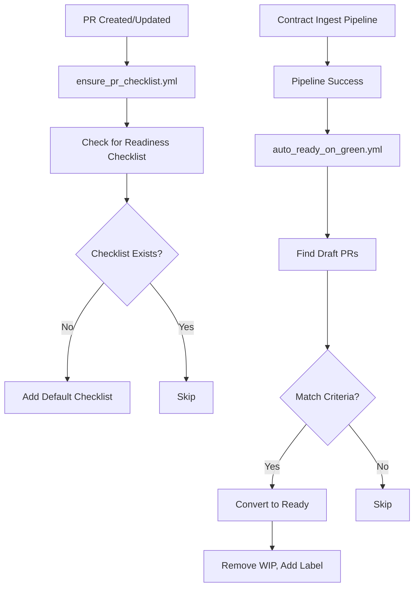

# PR Readiness Checklist Automation & Auto Ready Conversion Workflows

This implementation adds comprehensive automation for PR readiness checklists and auto-conversion of draft PRs when contract ingestion succeeds.

## 🆕 New Components

### GitHub Actions Workflows

1. **`.github/workflows/ensure_pr_checklist.yml`**
   - **Trigger**: PR opened/edited/synchronized/ready_for_review
   - **Function**: Automatically adds a comprehensive readiness checklist to PR descriptions if missing
   - **Permissions**: pull-requests: write, contents: read

2. **`.github/workflows/auto_ready_on_green.yml`**
   - **Trigger**: workflow_run completion of "Contract Ingest & SDK Pipeline"
   - **Function**: Converts draft PRs to ready-for-review when pipeline succeeds
   - **Criteria**: PRs with `feat(contract-ingest)` in title OR `contract` label
   - **Actions**: Removes draft status, strips `[WIP]` prefix, adds `ready-for-review` label

### Utility Scripts

1. **`scripts/contract/normalize_spec.ts`** (+ shell wrapper)
   - **Purpose**: Normalize OpenAPI specs for diff stability
   - **Features**: Sorts keys, removes volatile metadata, cleans versions
   - **Usage**: `./scripts/contract/normalize_spec.sh spec/openapi.json`

2. **`scripts/contract/publish_preflight.ts`** (+ shell wrapper)
   - **Purpose**: Check for duplicate npm/PyPI publishes
   - **Exit Codes**: 0=safe, 20=exists (skip), 1=error
   - **Usage**: `./scripts/contract/publish_preflight.sh --auto`

### Legacy Script Updates

1. **`scripts/generate_openapi.js`**
   - **Change**: Added deprecation notice and hard exit
   - **Override**: Set `OVERRIDE_OPENAPI_DEPRECATION=true` for development use
   - **Reason**: Prevent divergence from authoritative platform-dispatched specs

## 🔄 Integration Workflow



## 🧪 Testing

All components have been tested:

- ✅ Workflow YAML syntax validation
- ✅ TypeScript compilation and execution
- ✅ OpenAPI normalization with test specs
- ✅ Package existence checking (npm/PyPI)
- ✅ Deprecation notice functionality

## 📚 Usage Examples

### Normalize OpenAPI Spec
```bash
./scripts/contract/normalize_spec.sh openapi/latest.json openapi/normalized.json
```

### Check Package Publishing
```bash
# Auto-detect from project files
./scripts/contract/publish_preflight.sh --auto

# Check specific packages
./scripts/contract/publish_preflight.sh --npm @bondmcp/sdk@1.0.0 --pypi bondmcp-sdk@1.0.0
```

### Test Deprecated Script
```bash
# Will show deprecation notice and exit
node scripts/generate_openapi.js

# Override for development
OVERRIDE_OPENAPI_DEPRECATION=true node scripts/generate_openapi.js
```

## 🔧 Workflow Integration

These scripts are designed for GitHub Actions integration:

```yaml
- name: Normalize OpenAPI spec
  run: ./scripts/contract/normalize_spec.sh openapi/latest.json

- name: Preflight publish check
  id: preflight
  run: ./scripts/contract/publish_preflight.sh --auto
  continue-on-error: true

- name: Publish if safe
  if: steps.preflight.outputs.exit_code == '0'
  run: npm publish
```

## 📋 Checklist Template

The auto-generated checklist includes:

- **Code Quality**: Linting, testing, conventions
- **Contract & SDK Changes**: OpenAPI updates, generation, breaking changes
- **Documentation**: README, API docs, examples
- **Testing**: Unit, integration, manual testing
- **Security & Compliance**: Secrets, HIPAA, security assessment
- **Deployment Readiness**: Breaking changes, migration, rollback planning

## 🎯 Benefits

1. **Consistency**: Standardized readiness checks across all PRs
2. **Automation**: Reduces manual work for contract ingestion workflows
3. **Safety**: Prevents duplicate publishes and specification divergence
4. **Diff Stability**: Normalized specs produce cleaner, more meaningful diffs
5. **Quality Gates**: Ensures thorough review before deployment